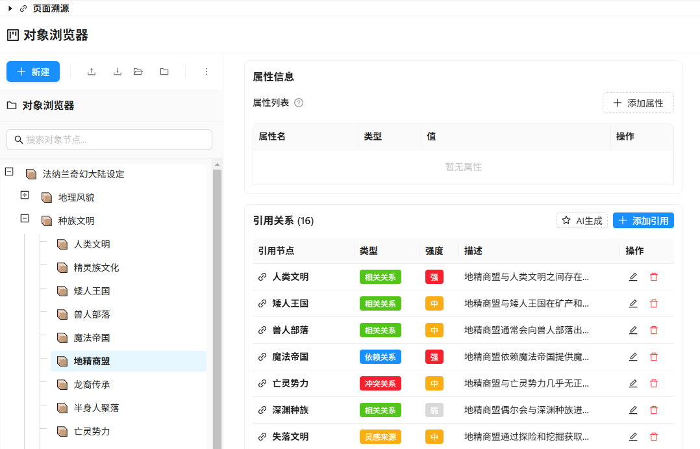

# Pointer 智能聊天助手


**中文版** | [English](README.md)

基于 Electron + React + TypeScript 开发的AI聊天应用，支持**多模型对话**、**交叉数据分析**和**知识组织管理**。

- 博客1：[AI 聊天应用的 10 条高级需求](https://www.cnblogs.com/experdot/p/18924253)
- 博客2：[解决了AI聊天的 10 个痛点后，新的功能：交叉分析表](https://www.cnblogs.com/experdot/p/18974641)

> 示例：渐进式交互，生成小说设定



## 主要特性

### AI对话系统

- 支持多 AI 模型配置 (OpenAI GPT、Claude、DeepSeek等)
- 流式对话响应，支持推理过程显示
- 消息树形分支管理，支持对话版本控制
- 聊天历史分层组织，标签页并行工作
- 全局内容搜索，关键词高亮
- 全局 AI 生成任务管理，支持任务监控和取消
- 全局问答溯源机制，追踪页面间的生成关系

### 独特功能

- **AI 交叉分析表**: 自动生成结构化对比分析表格
- **AI 对象管理器**: 可视化知识数据结构管理
- **数据导入导出**: 支持主流AI平台数据迁移（OpenAI ChatGPT / Deepseek Chat）

### 知识管理

- 文件夹层级组织
- 消息收藏和标记
- 批量操作和拖拽排序
- 数据备份和恢复

#### 主界面


#### 交叉分析表


#### 对象管理器


## 快速开始

### 环境要求

- Node.js 18+
- Windows 10+, macOS 10.15+, 或 Linux

### 安装运行

```bash
# 安装依赖
pnpm install

# 开发模式
pnpm dev

# 构建应用
pnpm build:win    # Windows
pnpm build:mac    # macOS
pnpm build:linux  # Linux
```

### 基本配置

1. 启动应用后进入设置页面
2. 配置AI模型参数：
   - 配置名称
   - API地址
   - 访问密钥
   - 模型标识符
3. 选择默认模型并测试连接

## 核心功能

### 交叉分析表

将任意主题转换为结构化对比分析表格，适用于：

- 学术研究的文献对比
- 商业决策的方案评估
- 教学材料的知识点整理
- 产品功能的竞品分析

操作流程：

1. 输入分析主题
2. AI自动生成表格结构
3. 填充交叉点数据
4. 手动编辑和优化

### 对象浏览器

可视化管理复杂数据结构，支持：

- 树状结构展示
- AI自动生成节点
- 手动编辑和组织
- 结构化数据导出

### 聊天分支管理

- 消息树状结构
- 分支间独立对话
- 历史版本切换
- 上下文继承

## 技术架构

### 核心技术

- **前端**: React 19 + TypeScript + Ant Design
- **后端**: Electron 主进程
- **构建**: Vite + Electron Builder
- **样式**: CSS Modules + SCSS

### 项目结构

```
src/
├── main/          # Electron主进程
├── renderer/      # 渲染进程
│   ├── components/  # React组件
│   ├── store/      # 状态管理
│   ├── services/   # 业务逻辑
│   └── utils/      # 工具函数
└── preload/       # 预加载脚本
```

### 关键依赖

- `react-markdown`: Markdown渲染
- `mermaid`: 图表绘制
- `katex`: 数学公式
- `html2canvas`: 截图功能
- `rehype-highlight`: 代码高亮

## 使用场景

**教育研究**: 课程设计、知识整理、文献分析  
**商业分析**: 市场调研、竞品对比、战略规划  
**内容创作**: 选题策划、素材组织、结构化写作  
**个人学习**: 笔记整理、知识对比、复习资料

## 开发贡献

### 开发流程

1. Fork项目并创建特性分支
2. 遵循TypeScript和ESLint规范
3. 提交代码并创建Pull Request

### 代码规范

- 使用函数式组件和Hooks
- 遵循conventional commits格式
- 保持代码类型安全

### 重点改进方向

- 缺陷修复
- 生成提示词与上下文优化
- 性能优化和用户体验改进

## 许可证

MIT License - 详见 [LICENSE](LICENSE) 文件
